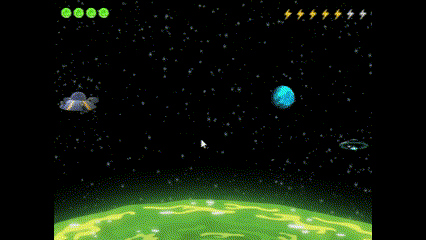

# A Rick and Morty Experience

## Introdução:

A Rick and Morty Experience é um jogo extraoficial baseado no seriado de TV "Rick and Morty" e o objetivo do jogo é através da nave usada pela dupla, acertar outra nave, ao lado direito da tela, sem atingir os planteas que estarão pelo caminho. O jogo é composto por 3 fases com dificuldades diferentes e atratores gravitacionais diferentes, descritos no tópico "Modelo Físico". 

## Como Jogar:

1. Cada fase possui sua quantidade de tiros disponíveis e quantidade de atratores gravitacionais. Cuidado para seu tiro não ser consumido por cada planeta;
2. Ajuste a velocidade pelo mouse, clicando no raio correspondente a velocidade escolhida ou altere nas setas de "cima" de "baixo" do teclado;
3. Para atirar, basta clicar com o botão esquerdo do mouse na direção a qual o tiro deve seguir. 

## Como Executar:

1. Instale o python em seu computador;
2. Clone esse repositório para sua máquina;
3. Instale as bibliotecas necessárias (contidas no requirements.txt);
4. Execute o jogo pelo arquivo main.py.

## Código:

O código está separado em arquivos, com cada arquivo comentado e desenvolvido em classes para melhor organização do projeto. Além disso, as sprites, os sons, o gif e os níveis estão separados em pastas diferentes. 
As configurações iniciais se encontram no aquivo constantes.py e as funções de colisão, no arquivo funcoes.py.

## Modelo Físico:

1. Para calcular a atração de cada planeta, o primeiro passo é calcular a distância entre a partícula (representada pelas coordenadas do mouse) e o corpo celeste. A função np.linalg.norm utilizada calcula a norma do vetor diferença entre as duas posições, resultando na distância entre elas;

2. O próximo passo foi calcular a direção da força gravitacional, que é um vetor unitário apontando do corpo celeste para a partícula. Para isso, o código subtrai as coordenadas da partícula das coordenadas do corpo celeste e divide o resultado pela distância calculada anteriormente para obter um vetor direção unitário;

3. Logo após, calcula a magnitude da força gravitacional. Cada corpo celeste diferente possui sua própria constante (que neste caso foi escolhida, para fazer a simulação mais agradável). Depois, divide essa constante pelo quadrado da distância entre a partícula e o corpo celeste ${d^2}$, seguindo a lei da gravitação universal de Newton. Multiplica esse resultado pela direção do vetor gravitacional para obter o vetor força gravitacional total;

4. Por final, basta atualizar a velocidade da partícula somando à velocidade atual o vetor de força gravitacional calculado anteriormente. Isso significa que a partícula será acelerada na direção do corpo celeste devido à força gravitacional, afetando sua trajetória no espaço.

## GIF com a Gameplay:

## Referências:
1. [ChatGPT](https://chat.openai.com/) para saciar dúvidas relacionadas ao pygame.
2. [RemoveBG](https://www.remove.bg/) para remover o fundo de sprites.
3. [Pixabay](https://pixabay.com/pt/) para download da música e efeitos sonoros.
4. [Wiki de Rick and Morty](https://rickandmorty.fandom.com/wiki/Rickipedia) para pesquisa sobre o universo e utilização de sprites.

## Créditos:
Jogo desenvolvido por Gustavo Colombi Ribolla.